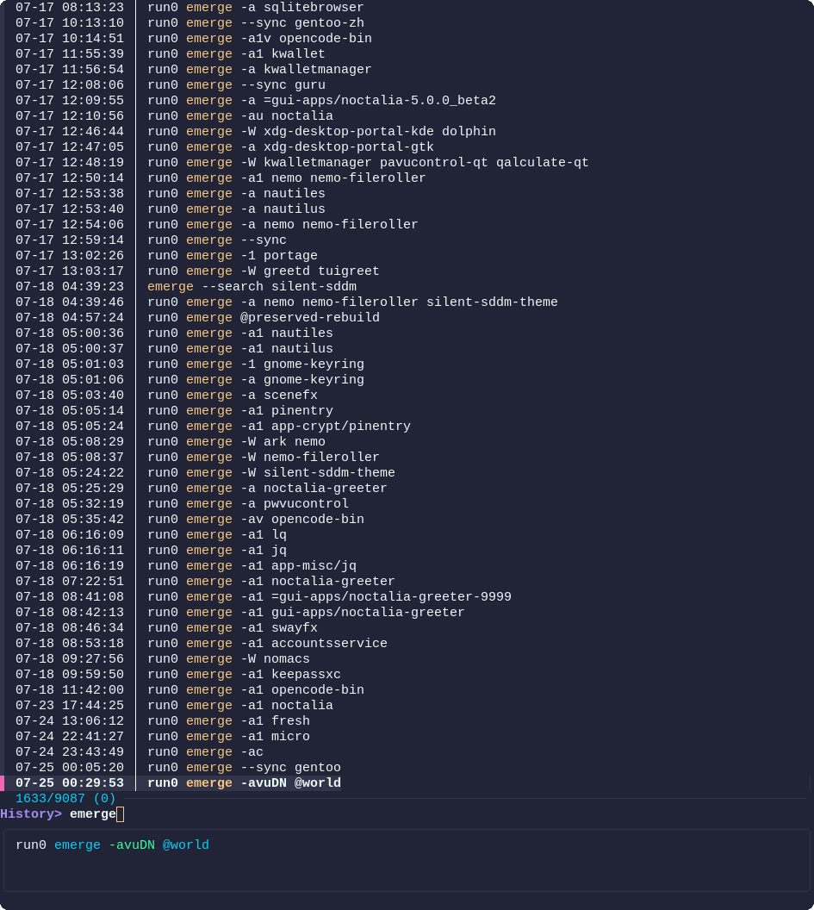
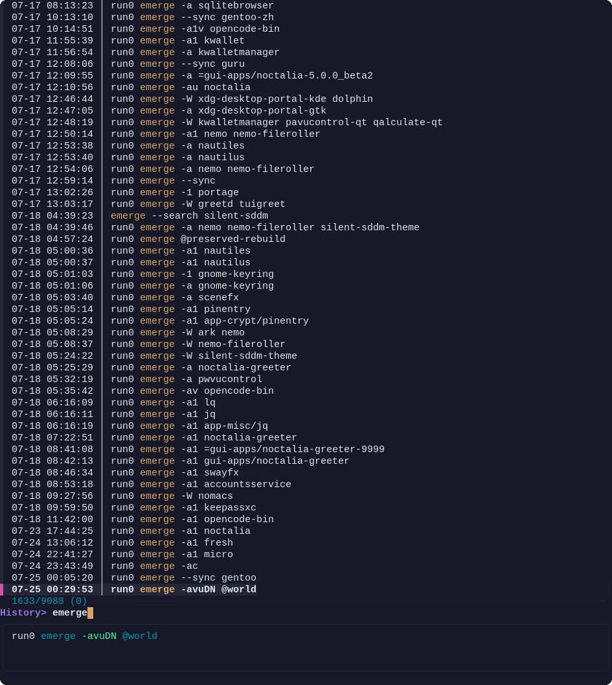
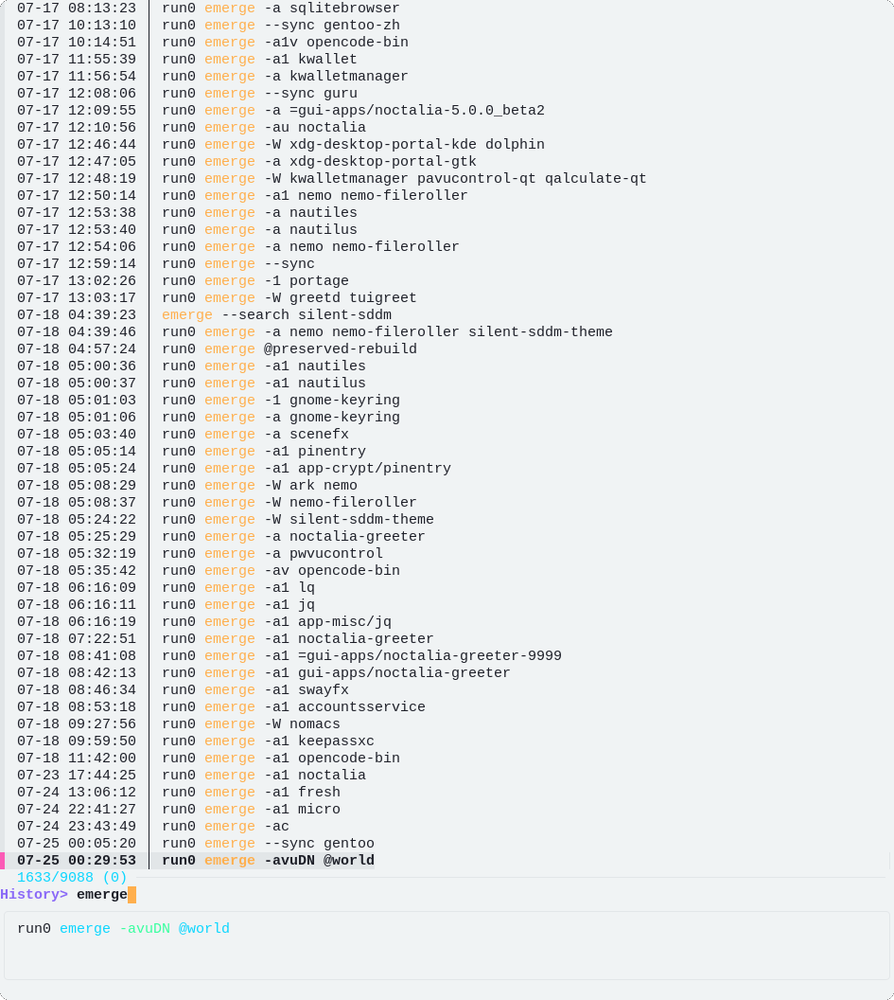

<!-- DO NOT CHANGE THIS -->
<p align="center">
  
</p>
<p>
  Eldritch is a community-driven dark theme inspired by Lovecraftian horror. With tones from the dark abyss and an emphasis on green and blue, it caters to those who appreciate the darker side of life.
</p>

Main Theme repo can be found [here](https://github.com/eldritch-theme/eldritch)

### Showcase

<details>
    <summary>🦑 Cthulhu (Default)</summary>
    
</details>
<details>
    <summary>🌀 Abyss (Darker)</summary>
    
</details>
<details>
    <summary>🌅 Dusk (Light)</summary>
    
</details>

### Installation

1. Download your preferred variant in [themes](themes) and place it in your home directory. e.g. `~/.config/eldritch-fzf-cthulhu.rc`

2. Export `FZF_DEFAULT_OPTS_FILE` in your shell pointing to the file of your preferred variant:
   ```sh
   export FZF_DEFAULT_OPTS_FILE="$HOME/.config/eldritch-fzf-cthulhu.rc"
   export FZF_DEFAULT_OPTS_FILE="$HOME/.config/eldritch-fzf-abyss.rc"
   export FZF_DEFAULT_OPTS_FILE="$HOME/.config/eldritch-fzf-dusk.rc"
   ```
